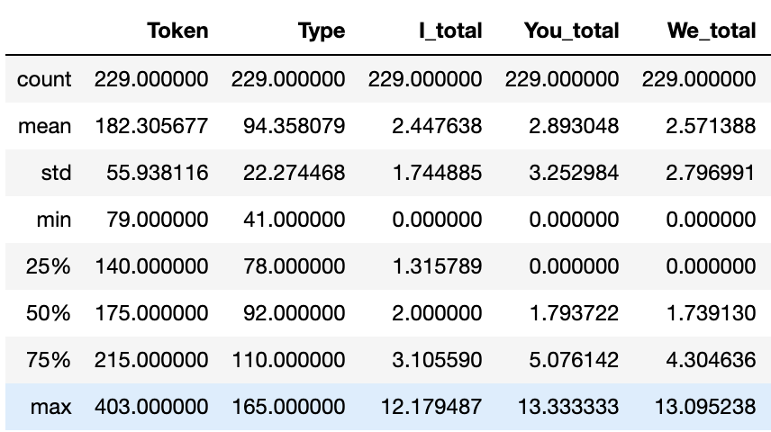
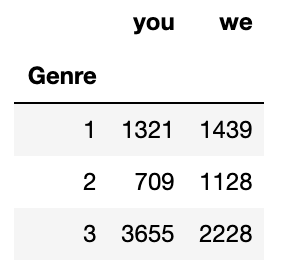

# statistics

记得之前再写关于Python绘制统计图的时候就说过，准备写一篇关于数理统计的。

一直都在忙论文，忙完后也比较懒散。就一直拖到了现在。

虽然时隔的比较久远，但还是准备把这个总结出来了。

所需要的Python库：pandas、numpy、plotly\(可选，便于绘图\)、scipy。

所借助的平台依旧是Jupyter Notebook。

我也记不得哪些是标准库哪些是第三方库了。Em...所以还得各位自己解决一下了。

具体数据都是用我论文里的数据，因为老师的要求，数据是不能被公开的，所以就不发数据啦。

## 第一步：创建DataFrame

当然用DataFrame的数据类型不是必要的条件。用List以及Array的类型也都可以。但因为统计分析难免会涉及数据的清洗、整合这些管理工作，Pandas本身就很好的提供了这些管理的方法，所以比较推荐这么做。

将手头的数据转化成DataFrame的方法有很多。具体情况具体分析，可以去官网上查找一下资料。我比较喜欢的是直接从csv文件里读取出来。

```python
df = pandas.read_csv('***.csv')
```

读取完数据之后，就要进行清洗整合了，这个我就不具体说明了。不同的数据，清洗整合的方法、要求都不一样。

## 第二步：先看看数据的基本统计量

简单的说，就是先看看**平均值，方差，最小值、最大值、四分位数**这些基本的统计量。

方法也很简单，直接用DataFrame对象的describe方法就可以了。

```python
df.describe()
```

这时候，你会看到输出了一个表格。



最左边那栏第一个count表示的是数据的个数，其他的我就不解释了。

最上面那栏就是元数据的各个列名。

如果有时候数据很庞大，有很多列。而你只需要一小部分。那么可以直接先筛选完在用describe方法就可以了。

例如：

```python
df[["Token"]].describe()
```

注意是**两层中括号，不要弄错了**。

## 第三步：检验正态性（划重点）和同方差检验

为什么我会给这一步划重点呢，因为它非常重要。很多很多像我这样不是专门学数学的人，都会在分析数据之前，忘记做也懒得做这一步。

但是很多统计检定都是基于正态分布的情况下才进行的。比如T检定、ANOVA等等。

检验正态性的方法也很多，我就给大家总结两种。具体原理什么的别问我。我不是学数学的，数学也很差，我只是来负责总结的！

**当样本容量比较小（大概N&lt;=50）的时候，我们可以用shapiro**。

```python
from scipy import stats

stats.shapiro(df["Type"])
```

**当样本容量比较大（大概N&gt;50）的时候，我们可以用normaltest**。

```python
from scipy import stats

stats.normaltest(df["Type"])
```

返回结果都是差不多的，形式有点不一样而已。

```python
NormaltestResult(statistic=18.447504402798188, pvalue=9.866777084255565e-05)
```

前一个表示**统计量**，Em..其实可以不用管它是干什么的。

后一个是**p值**。

可以看到我这里的结果是p&lt;0.05的，所以H1假说成立。也就是该样本与正态分布存在的明显的差异，即认定该样本不服从正态分布。

## 第四步：开始统计检定

具体的检定方法视需求而定。我就介绍几种比较常见的检定方法。

**T检定**：_**切记，T检定的样本一定要符合正态分布！**_

_单样本的T检定_：这种检定方法用于实验样本和理想模型进行的差异检定。这在我们的研究里是比较少见。

```python
from scipy import stats

stats.ttest_1samp(df["Token"], 50) # 后面的数字是理想模型平均值
```

_双样本的T检定_：这种检定方法是用于检测两个样本之间的差异的。由于我们这种做实验的一般都是设置对照组和实验组，所以会比较常用到。

```python
from scipy.stats import ttest_ind

ttest_ind(df1["Token"],df2["Token"])
```

返回值一般也都是两个，前一个是**统计量**，后一个是**p值**。

当p值&gt;=0.05的时候，H0假说成立，即认为两个样本之间没有有意差。

当p值&lt;0.05的时候，H1假说成立，即认为两个样本之间存在有意差。

**方差分析（ANOVA）**：_**切记，ANOVA的样本也一定要符合正态分布！**_

因为单因素的ANOVA对我来说是最常见的，所以就只做这个介绍了。简单的说，就是因为一个因素的影响获取了3个样本，进行对比分析。比如pre-test、mid-test、post-test，这样三组的数据。就是test种类一种因素而取得的3个样本。

```python
from scipy import stats

print(stats.f_oneway(df1["Token"],df2["Token"],df3["Token"]))
```

返回的结果和前面T检定的结果是一样的，就不再重复赘述了。

如果你需要多因素的ANOVA，就会涉及到建立模型等等东西。可以参考：[python数据统计分析](https://blog.csdn.net/xieyan0811/article/details/87512657)

**卡方检定**：卡方检定的样本不一定需要符合正态分布。

卡方检定多用于检定一个样本某两个数据的比值是否存在差异（至少我是这么理解的）。我的论文是关于不同语料库中，两个词相对使用频率的差异。所以我就用了这种检定方法。

例如，现在有3个数据库。然后要通过卡方检定，判断每个语料库里you和we的相对使用情况是否有差异。



```python
word_you = [1321, 709, 3655] # 注意是同一个项目放在一个列表里
word_we = [1439, 1128, 2228]

chi2 = [word_you, word_we] # 创建卡方检定用的数据

from scipy.stats import chi2_contingency

chi2_contingency(chi2)
```

返回结果

```python
(373.8664636208034,
 6.545290707527789e-82,
 2,
 array([[1497.19465649,  996.5023855 , 3191.30295802],
        [1262.80534351,  840.4976145 , 2691.69704198]]))
```

第一个是**效果量**，第二个是**p值**，第三个是**自由度**，第四个是**校准值**。

像我这种统计初学者的话只用在意前两个结果就好。

效果量，顾名思义就是效果，越大说明效果越明显。

p值什么意思就不多说了。

总而言之，从这个结果来看，三个语料库中，两个单词的相对使用情况是存在显著的有意差的。

## 大功告成，写报告。

其实Python可以做的数理统计还有很多很多。因为我本身对这数学方面不是特别的熟悉，也不好深究。

所以各位有需求的话可以多去网上搜搜资料就好了，我这里只是最了一个最最最最简单基础的总结罢了。

[知乎链接](https://zhuanlan.zhihu.com/p/119319339)

